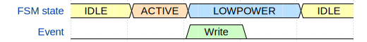
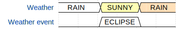
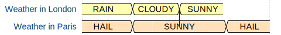

# Dramatic introduction
How do you know that important things have happened in a simulation? By defining and analyzing functional coverage. How do you know that a particular scenario has been executed? Please don't tell me that you sample some covergroup at the end of the test. This way one can only be sure that the testcase has finished, not that it has done anything meaningful. A more responsible approach is to define what is "scenario" is and cover this definition.

Let's try to do that. A DUT can be viewed as one big FSM, but a "scenario" is a general description of a DUT's adventures, so not every trigger matters. Thus there's an FSM inside DUT, whose state sequence together with inputs defines a scenario. In other words, a scenario is DUT's FSM going through the sequence of expected states, while being stimulated with particular inputs. 

For example, imagine some SERDES with 3 modes of operation: transfer data, wait for data, and power-saving. Configuration registers, link width and speed don't interest us, so the scenario boils down to the sequence of FSM states: ACTIVE, IDLE, LOWPOWER. While configuration registers are not interesting, the fact they were accessed may in fact be important. We can view it as FSM inputs. Let's call such inputs *events*. Here's a scenario example.
```json
{
    "signal": [
        {
        "name": "FSM state",
        "wave": "345.3",
        "data": [
            "IDLE",
            "ACTIVE",
            "LOWPOWER",
            "IDLE"
        ]
        },
        {
        "name": "Event",
        "wave": "0.70.",
        "data": "Write"
        }
        ],
    "config": {
        "hscale": 2
    }
}
```


Now return to the main question. How do you cover it? SystemVerilog has transition coverage, so you may be able to get away with just FSM state sequence coverage. Not very easy to write and maintain, but it's okay. But we need to account for events, too. Still looks manageble? Oh, wait, our device consists of TX and RX parts, actually! Now we have a cross of two FSMs and events and absolutely zero motivation to solve this problem with covergroups.

That's why you need Censor.

# Censor
Censor consists of two parts: a .Net tool that generates SystemVerilog code from a WaveDrom-like JSON and a bunch of SystemVerilog classes that match observed FSM states and events with expected ones (with input WaveDrom diagram). Generated SystemVerilog code contains a covergroup of a single coverpoint, with a bin for every scenario. The testbench samples states and events of the required FSMs and Censor covers a respective bin once the sampled FSM state and events match those described by WaveDrom.

## Installation
1. Clone the repository.
2. Compile code generator:
```bash
cd CensorSln
make publish
```
3. Set environment variable `$CENSOR_ROOT` to point to `sv/src`.
4. Include Censor filelist into your TB filelist:
```
-f $CENSOR_ROOT/censor.list
```
5. Add `import censor_pkg::*` wherever needed.

## Usage
### Generate SV code
To generate SV code from JSON:
```
Censor -i input.json -o output.sv
```
I suggest adding a Makefile target, like this:
```Makefile
GENERATOR=$(PROJ_ROOT)/CensorSln/bin/Censor
INPUT?=$(PROJ_ROOT)/jsons/real_example.json
OUTPUT?=$(PROJ_ROOT)/sv/test/tb/weather_coverage.sv

generate:
	$(GENERATOR) -i $(INPUT) -o $(OUTPUT)
```
Don't forget to include the resulting SV file into your TB.
### 
Create a censor class:
```SystemVerilog
weather_coverage wc = new();
```
If you want to use a static pool, set it there
```SystemVerilog
censor_pool::set("SOME_SCOPE", wc);
```
Then you will only need to call methods `sample_state(fsm_name, state_name)` and `sample_event(fsm_name, event_name)` whenever something happens with FSM.

## JSON format
You can find a full example in `jsons/real_example.json`. Here we'll break it by parts.
### Header
```json
  "$schema": "../mySchema.json",
  "class_name": "weather_coverage",
  "enum_name": "weather_cg_enum",
  "covergroup_name": "weather_scenario_cg",
  "fsm_descriptions": [
    {
      "source_name": "weather_fsm0",
      "valid_states": ["SUNNY", "CLOUDY", "RAIN", "SNOW", "HAIL"]
    },
    {
      "source_name": "weather_fsm1",
      "valid_states": ["SUNNY", "CLOUDY", "RAIN", "SNOW", "HAIL"]
    },
    {
      "source_name": "leisure_fsm",
      "valid_states": ["WALK","SLEEP","MOVIE","CAFE","BIKE"]
    }
  ]
```
The `$schema` property is not necessary, but it'll help to write a correct JSON.

The `class_name` property sets the name of the generated class. It's best to have it the same as the name of the output file, but the choice is yours. The `enum_name` property is the name of the enum type, which variable will be covered by an internal covergroup. The `covergroup_name` is self-explanatory.

For each FSM in the TB, you shall provide a description in the `fsm_descriptions` array. It has two fields: `source_name` is the FSM name by which you will refer in the SV source code. The `valid_states` describe possible states of the FSM. It can be extended with synonyms, as we will see below. Attempting to sample any other state will trigger an error from Censor.

### Scenarios
Each scenario is a WaveDrom-compatible JSON, which can be copy-pasted and rendered there. We will go through a different example to show various features of CensorJSON.
#### One FSM and its event
Let's see one example.
```json
{
    "description": "Eclipse in the rain",
    "scenario_name": "ECLIPSE_EVENT",
    "signal": [
        {
        "name": "Weather",
        "wave": "2.3.4.",
        "data": ["RAIN","SUNNY","RAIN"],
        "event_name": "Weather event",
        "source_name": "weather_fsm0"
        },
        {
        "name": "Weather event",
        "wave": "0.2.0.",
        "data": ["ECLIPSE"]
        }
    ]
}
```


This scenario describes the FSM `weather_fsm0` going through states RAIN, SUNNY and RAIN again. While the FSM is in state SUNNY, there should be an event called ECLIPSE.

When Censor finds a WaveDrom line with either the `name` field that matched one of the FSM descriptions or `source_name`, it counts it as an FSM. Having separate `name` and `source_name` allow you to have a pretty-looking diagram without ugly names displayed.

The property `event_name` connects an FSM with its events. It shall correspond to one of the `name` fields among other WaveDrom lines.

When describing an FSM, particular `wave` values do not matter, they only should be between 2 and 9.

When describing events, the duration of each event does not matter, it shall only start during the corresponding state of the FSM.

#### Two related FSMs
```json
{
    "description": "Example of states' intersection",
    "scenario_name": "WEATHER_CROSS",
    "signal": [
        {
        "name": "Weather in London",
        "source_name": "weather_fsm0",
        "wave": "333",
        "data": ["RAIN","CLOUDY","SUNNY"],
        "node": "..A"
        },
        {
        "name": "Weather in Paris",
        "wave": "44.4",
        "data": ["HAIL","SUNNY","HAIL"],
        "node": "..B",
        "source_name": "weather_fsm1"
        }
    ],
    "edge": [
        "A~-B"
    ],
    "config": {
        "hscale": 2
    }
}
```


By default, any FSMs present in the `signal` are completely independent. The coverage will close once the most recent states of all listed FSMs will be the same as in the description. If you want to have a timed relationship between different FSMs, like "there should be a moment in time when FSM 1 is in state X and FSM 2 is in state Y", you have two options. The first one is present in this example: connect two states with `edge` and `node` properties. It sets the relationship only between the two connected states.

The other option is to use the `full_intersection` property, like this:
```json
{
    "description": "Full intersection example",
    "scenario_name": "FULL_INTERSECT",
    "full_intersection": [
        [
        "weather_fsm0",
        "weather_fsm1"
        ]
    ],
    "signal": [
        ...
```

It sets relationship between all states of the listed FSMs. 

# FAQ
## String names are bad, why don't you use enums?
Strings are easy. Valid FSM states may vary from scenario to scenario. Shall we make an enum with *all* states? An enum per scenario? Where shall we keep all enums? Will all simulators be able to access a type inside a class?

These are questions that require careful consideration later. While strings just work now.

## How does Censor handle sampling the same state repeatedly, e.g. on each clock posedge?
Two consecutive states with the same names are counted as one. In other words, observed states are not updated when the sampled state is the same as the last one. I have a plan to add an option to alter this behaviour.

# TODO
- [ ] Installation script
- [ ] Option to handle repeated states as same or different
- [ ] Runtime info print
- [ ] Limit events to only expected ones
- [ ] Create and add to pool in one method
- [ ] Upload JSON schema?
- [ ] Add enums for FSMs and other entities? Won't it bring too much complexity in usage?
- [ ] Add ability to reduce the set of valid states per scenario.
- [ ] More than 2 FSMs listed in `full_intersection`.